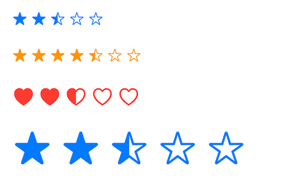

# RatingControl

⭐️ Fully customizable star ratings for iOS.

[![Swift Version][swift-image]][swift-url]
[![License][license-image]][license-url]
[](https://img.shields.io/cocoapods/v/RatingControl.svg)
[](http://cocoapods.org/pods/RatingControl)
[](http://makeapullrequest.com)



## Features

* Custom maximum rating value (default: 5)
* Support for decimal rating values (e.g., 3.5 stars)
* Custom images
* Custom size
* Rate using both tap and pan gestures

## Usage

### Basic Usage

Create a simple rating control with default settings:

```swift
let ratingControl = RatingControl()
ratingControl.value = 3.5 // Set initial rating
```

### Customization

Customize appearance and behavior:

```swift
let ratingControl = RatingControl()
ratingControl.maxValue = 7 // 7 stars instead of default 5
ratingControl.value = 4.5
ratingControl.spacing = 8 // Increase spacing between stars
ratingControl.tintColor = .systemOrange // Change color
ratingControl.emptyImage = UIImage(systemName: "heart")! // Custom empty image
ratingControl.image = UIImage(systemName: "heart.fill")! // Custom filled image
```

### User Interaction

Listen for rating changes:

```swift
ratingControl.addTarget(self, action: #selector(ratingChanged), for: .valueChanged)

@objc func ratingChanged(_ sender: RatingControl) {
    print("New rating: \(sender.value)")
}
```

Alternatively, disable user interaction:

```swift
ratingControl.isUserInteractionEnabled = false
```

## SwiftUI Support

### RatingView

Use the SwiftUI wrapper to integrate ratings in your SwiftUI views:

```swift
struct ContentView: View {
    @State private var rating: Double = 3.5
    
    var body: some View {
        VStack {
            // Basic usage
            RatingView(value: $rating)
            
            // Show current value
            Text("Rating: \(rating, specifier: "%.1f")")
            
            // Customization
            RatingView(value: $rating, maxValue: 7)
                .emptyImage(UIImage(systemName: "heart")!)
                .filledImage(UIImage(systemName: "heart.fill")!)
                .spacing(10)
                .imageSize(CGSize(width: 32, height: 32))
                .accentColor(.red)
                
            // Fixed (non-interactive) rating
            RatingView(value: 4.5)
                .disabled(true)
        }
    }
}
```

### Available Modifiers

- `emptyImage(_:)` - Sets the image for empty (unfilled) parts
- `filledImage(_:)` - Sets the image for filled parts
- `spacing(_:)` - Sets spacing between images
- `imageSize(_:)` - Sets custom size for the images
- Use SwiftUI's `.accentColor(_:)` to change the color
- Use SwiftUI's `.disabled(_:)` to make it non-interactive

## Installation

### CocoaPods:

```ruby
pod 'RatingControl'
```

### Swift Package Manager:

```swift
dependencies: [
    .package(url: "https://github.com/yonat/RatingControl", from: "1.0.0")
]

[swift-image]:https://img.shields.io/badge/swift-5.9-orange.svg
[swift-url]: https://swift.org/
[license-image]: https://img.shields.io/badge/License-MIT-blue.svg
[license-url]: LICENSE.txt
